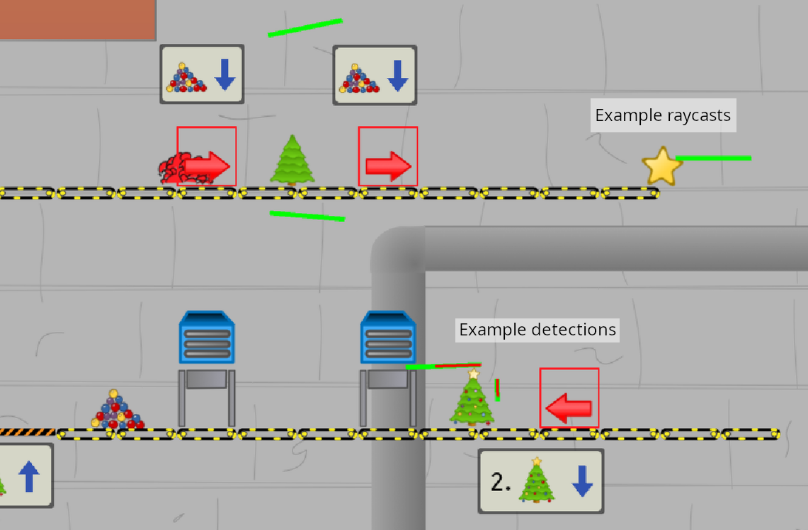

# godot-raycast-debugger

About: A godot debugging class for visualizing raycast results for easier debugging.

Purpose: Don't you hate it when you're trying to debug a tricky problem with raycasting,
which is hard enough to understand in the first place, and you have no clue where the
problem is other than "things seem to be missing each other".  This class comes to the
rescue and provides an easier raycast API complete with optional visualization of both
rays being cast and what those rays are coming into contact with.  It graphically 
draws green lines from the ray source to destination for every ray cast since the 
last time the screen was rendered.  If the ray produces a collision, then a second
red line will be drawn from source to the target that got hit.

See the screenshot of detection from multiple objects, where the green
lines indicate the rays projected and the red lines show the
collisions detected.



# Usage

1. Copy the raycast_debugger.gd script to your project's source code.

2. Initialize the class as a child of the class you want to draw
   inside whatever object you are casting from.  Set the
   `enableDebugging` flag to `true` in order to turn on the graphical display.

``` gdscript
var castdebugger: RayCastDebugger2D

func _ready() -> void:
    # ...
	castdebugger = RayCastDebugger2D.new()
	castdebugger.enableDebugging = true
	add_child(castdebugger)
    # ...

```

3. use the `.intersect_ray(source, dest, ignore_objects)` API for casting a ray,
which will return a collision object or `none`.

``` gdscript
func _physics_process(delta: float) -> void:
    Vector2 from_location = global_position
    Vector2 to_the_right = global_position + Vector2(200, 0)

    # ...
    var result = castdebugger.intersect_ray(from_location, to_the_right, [self])
    if result:
        # handle collisions the way you normally would
    # ...
```

4. If you've solved all your debugging issues, you can set the
`enableDebugging` flag to `false` to turn off the visual raycast lines.

# Still TODO

Right now this is useful for raycast debugging when doing raycasting
directly in code (which I think is more common).  What is not done yet
is an implementation based on the RayCast2D object, nor is an
implementation of anything in 3D yet.

TL;DR:

- An implementation based on the RayCast2D object
- An implementation based on the RayCast3D object
- An implementation based on direct coding in 3D

# Example video

Watch the [tutorial and demonstration video](https://youtu.be/3Yex3HdTaVk)


